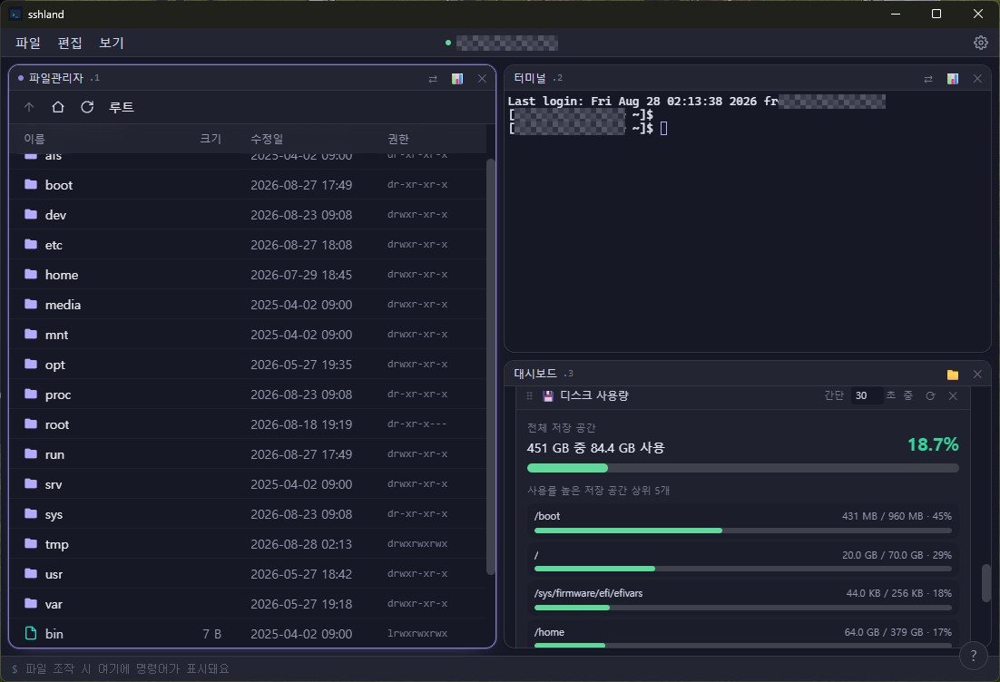
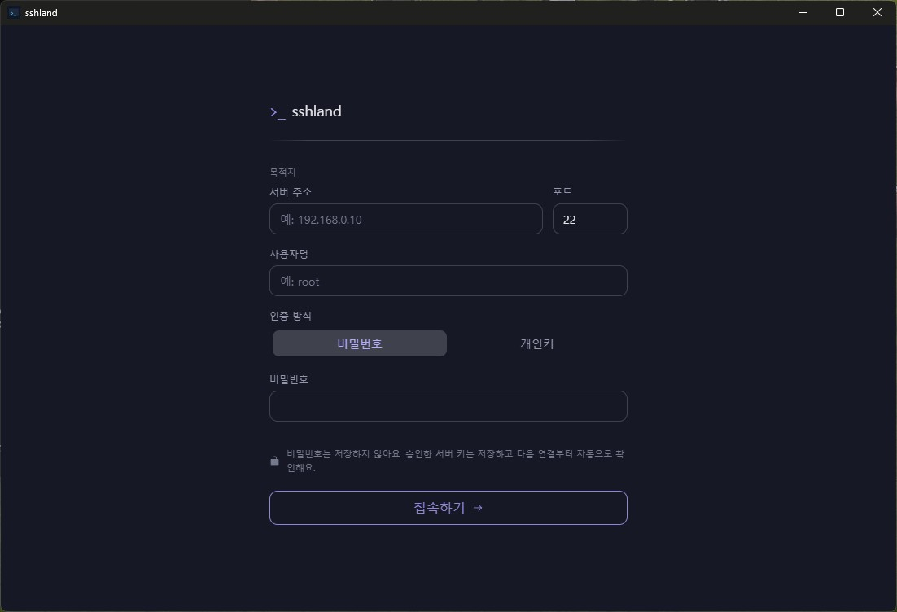
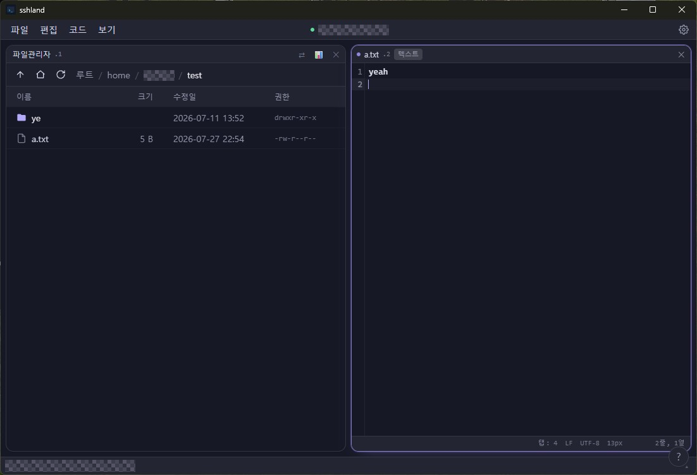

# sshland

[](https://github.com/q09009/sshland/actions/workflows/ci.yml)
[](https://github.com/q09009/sshland/actions/workflows/dependency-audit.yml)
[](LICENSE)

초보자도 SSH와 SFTP를 어렵지 않게 사용할 수 있도록 만든 가벼운 원격 작업 공간입니다. 하나의 SSH 연결 안에서 파일관리자, 터미널, 코드 편집기, 서버 대시보드를 타일 형태로 배치해 사용할 수 있습니다.

복잡한 IDE를 대체하기보다 서버에 접속해 파일을 찾고 수정하고, 명령을 실행하고, 상태를 확인하는 일상적인 원격 작업에 집중합니다.

> [!IMPORTANT]
> 최신 공개 버전은 `v0.1.0` 프리릴리스이며 설치 파일은 [GitHub Releases](https://github.com/q09009/sshland/releases/tag/v0.1.0)에서 받을 수 있습니다. 중요한 서버에서 사용하기 전에는 [보안 및 주의사항](#보안-및-주의사항)을 확인해주세요.



## 화면

<table>
  <tr>
    <td width="50%"></td>
    <td width="50%"></td>
  </tr>
  <tr>
    <td align="center">비밀번호·개인키 SSH 접속</td>
    <td align="center">SFTP 파일관리자와 원격 코드 편집기</td>
  </tr>
</table>

## 주요 기능

### SSH와 파일 작업

- 비밀번호 또는 개인키 인증과 앱 전용 `known_hosts` 호스트 키 검증
- 목록·자세히·큰 아이콘 보기를 지원하는 SFTP 파일관리자
- 파일과 폴더의 재귀 업로드, 파일 다운로드, 서버 내 복사, 이동, 이름 변경, 삭제
- 여러 전송의 진행 상태와 실패 내역을 확인하는 공통 상태 표시줄

### 터미널과 편집기

- xterm.js 기반 터미널과 Linux 방식의 복사·붙여넣기 단축키
- CodeMirror 기반 원격 코드 편집기
  - 구문 강조, 찾기·바꾸기, 주석, 들여쓰기, 줄 이동·복제
  - UTF-8이 아닌 텍스트를 감지하고 저장할 때 기존 인코딩 유지
  - 서버에서 파일이 바뀐 경우 다시 불러오기 또는 명시적 덮어쓰기 선택
- 파일관리자, 터미널, 편집기, 대시보드를 자유롭게 분할하는 pane 작업 공간

### 서버 대시보드와 자동화

- CPU, 메모리, 디스크, 네트워크 I/O, 프로세스와 Docker 상태 위젯
- 초보자를 위한 간단 보기와 원본 명령 결과를 유지하는 상세 보기
- 위젯의 순서·크기·새로고침 주기를 조절하는 대시보드 편집
- 반복 명령을 순서대로 실행하거나 셸 스크립트로 내보내는 매크로
- TOML 파일로 확장할 수 있는 명령 GUI와 대시보드 위젯

### 인터페이스

- 시스템 언어 자동 선택과 설정에서 전환할 수 있는 한국어·영어 UI
- 배경색·배경 이미지·강조색·동작 효과·글꼴을 조절하고 TOML로 공유하는 테마 설정
- 서버 시간, 연결 상태, 명령·전송 상태를 한곳에 보여주는 상단·하단 표시줄

한 번에 하나의 SSH 연결만 활성화되며, 화면에 열린 모든 pane은 같은 서버 연결을 공유합니다.

## 현재 지원 범위

| 항목 | 상태 |
| --- | --- |
| Windows | 주 개발 환경. 실제 앱 실행을 확인했고 CI에서 프런트엔드·Rust 검사와 Tauri 실행 파일 빌드를 수행합니다. |
| Fedora Linux | 필요한 시스템 패키지를 설치한 뒤 수동 실행을 확인했습니다. |
| macOS | 아직 검증하지 않았습니다. |
| 원격 서버 | Linux 계열 SSH 서버를 기준으로 합니다. 기본 대시보드와 명령 GUI는 `sh`, `df`, `ps` 같은 일반적인 Linux 명령을 사용합니다. |
| Docker | 선택 사항입니다. 서버에 Docker가 없거나 실행 권한이 없으면 Docker 위젯만 사용할 수 없음 상태로 표시됩니다. |
| 배포 방식 | [GitHub Releases — v0.1.1](https://github.com/q09009/sshland/releases/tag/v0.1.1) |

## 기술 구성

- [Tauri 2](https://v2.tauri.app/) + Rust
- React 18 + TypeScript + Vite
- Tailwind CSS + zustand
- ssh2 / SFTP
- xterm.js
- CodeMirror 6

## 설치 준비

다음 도구가 필요합니다.

- [Node.js](https://nodejs.org/)와 npm — CI는 Node.js 22를 사용합니다.
- [Rust](https://www.rust-lang.org/tools/install) stable toolchain
- Git
- 운영체제별 Tauri 빌드 의존성

Windows에서는 Microsoft C++ Build Tools와 WebView2가 필요합니다. macOS와 Linux는 Xcode 또는 WebKitGTK 등의 시스템 패키지가 필요합니다. 정확한 준비 과정은 [Tauri 2 prerequisites](https://v2.tauri.app/start/prerequisites/)를 따라주세요.

설치 상태는 다음 명령으로 확인할 수 있습니다.

```bash
node --version
npm --version
rustc --version
cargo --version
```

## 개발 환경에서 실행

```bash
git clone https://github.com/q09009/sshland.git
cd sshland
npm ci
npm run tauri dev
```

처음 실행할 때는 npm 패키지와 Rust crate를 내려받고 컴파일하므로 시간이 걸릴 수 있습니다. 이후에는 변경된 부분만 다시 빌드됩니다.

`npm run dev`는 Vite 프런트엔드만 실행합니다. SSH, SFTP, 파일 선택 창 같은 Tauri 기능까지 사용하려면 `npm run tauri dev`로 실행해야 합니다.

## 설치 파일 빌드

```bash
npm ci
npm run tauri build
```

완성된 실행 파일과 운영체제별 설치 패키지는 기본적으로 다음 경로에 생성됩니다.

```text
src-tauri/target/release/bundle/
```

프런트엔드 타입 검사와 프로덕션 번들만 확인하려면 다음 명령을 사용합니다.

```bash
npm run build
```

## 사용 방법

### 1. 서버에 접속하기

1. 서버 주소와 SSH 포트를 입력합니다. 기본 포트는 `22`입니다.
2. 서버 사용자명을 입력합니다.
3. 인증 방식을 선택합니다.
   - **비밀번호**: 계정 비밀번호를 입력합니다.
   - **개인키**: 로컬 개인키 파일을 선택하고 필요한 경우 키 암호를 입력합니다.
4. **접속하기**를 누릅니다.
5. 처음 접속하는 서버라면 표시된 호스트 키 지문을 신뢰할 수 있는 경로로 확인한 뒤 승인합니다.

성공한 접속의 서버 주소, 포트, 사용자명, 인증 방식과 개인키 경로는 다음 실행 때 자동 입력됩니다. 비밀번호와 개인키 암호는 저장하지 않습니다.

### 2. 파일관리자 사용하기

- 폴더를 더블 클릭하면 해당 폴더로 이동합니다.
- 편집 가능한 파일을 더블 클릭하면 코드 편집기 pane에서 엽니다.
- 파일이나 빈 공간을 마우스 오른쪽 버튼으로 눌러 새 파일·폴더, 다운로드, 복사, 이름 변경, 삭제 메뉴를 사용할 수 있습니다.
- 로컬 파일이나 폴더를 파일관리자 위로 끌어놓으면 현재 원격 폴더에 업로드합니다. 폴더의 하위 구조와 빈 폴더도 그대로 생성됩니다.
- 원격 항목을 다른 폴더로 끌어놓으면 해당 폴더로 이동합니다.
- 상단의 **보기** 메뉴에서 목록, 자세히, 큰 아이콘 보기와 숨김파일 표시를 변경할 수 있습니다.

> [!CAUTION]
> 업로드 대상에 같은 이름의 원격 파일이 있으면 별도 확인 없이 덮어씁니다. 같은 이름의 원격 폴더는 병합되며, 그 안의 같은 이름 파일도 덮어씁니다. 중요한 경로에 업로드하기 전에는 백업을 권장합니다.

### 3. 터미널 사용하기

pane 헤더의 전환 버튼으로 파일관리자와 터미널을 바꿀 수 있습니다. 터미널의 `Ctrl+C`는 일반 Linux 터미널과 같이 실행 중인 명령에 인터럽트를 전달합니다.

| 기능 | 단축키 |
| --- | --- |
| 선택 영역 복사 | `Ctrl+Shift+C` 또는 `Ctrl+Insert` |
| 붙여넣기 | `Ctrl+Shift+V` 또는 `Shift+Insert` |

### 4. 코드 편집기 사용하기

파일관리자에서 텍스트 파일을 열면 별도의 편집기 pane이 생성됩니다. 같은 파일을 다시 열면 기존 pane을 재사용합니다.

| 기능 | 단축키 |
| --- | --- |
| 저장 | `Ctrl+S` |
| 서버에서 다시 불러오기 | `Ctrl+Shift+R` |
| 찾기·바꾸기 | `Ctrl+F` |
| 특정 줄로 이동 | `Ctrl+G` |
| 줄 주석 전환 | `Ctrl+/` |
| 줄 위·아래로 이동 | `Alt+↑` / `Alt+↓` |
| 줄 아래에 복제 | `Shift+Alt+↓` |
| 줄 삭제 | `Ctrl+Shift+K` |

저장하지 않은 파일에는 파일명 옆에 점이 표시됩니다. 이 상태에서 pane을 닫거나 서버 내용을 다시 불러오면 확인 창이 나타납니다.

### 5. pane 분할하기

| 기능 | 단축키 |
| --- | --- |
| 좌우 분할 후 새 터미널 열기 | `Alt+Shift+H` |
| 상하 분할 후 새 터미널 열기 | `Alt+Shift+V` |
| pane 포커스 이동 | `Alt+방향키` |
| 현재 pane 닫기 | `Alt+Shift+W` |
| 현재 pane 명령 검색 | `Ctrl+Shift+P` |

pane 사이의 경계를 드래그하면 크기를 조절할 수 있습니다. 마지막 남은 pane은 닫히지 않습니다.

### 6. 대시보드와 설정

- pane 헤더의 대시보드 버튼으로 서버 상태 위젯 화면을 엽니다.
- **위젯 추가**에서 필요한 항목만 고르고 카드의 순서·크기·새로고침 주기를 조정할 수 있습니다.
- 디스크·네트워크·프로세스·Docker 카드는 **간단/상세** 보기를 전환할 수 있습니다.
- Docker 위젯은 상태만 조회하며 시작, 중지, 재시작 같은 관리 명령은 실행하지 않습니다.
- 설정에서 언어, 명령 GUI, 명령 로그, 대시보드, 시계 표시와 테마를 조정할 수 있습니다.
- 대시보드 위젯은 설정한 주기에 따라 원격 명령을 실행하므로, 주기를 너무 짧게 설정하면 서버 요청이 늘어날 수 있습니다.

### 7. 디자인 테마 공유하기

설정의 **테마 → 공유 테마**에서 현재 디자인을 `.toml` 파일로 내보내거나, 다른 사람이 만든 테마를 가져와 바로 적용할 수 있습니다. 가져온 테마는 목록에 보관되며 **폴더 열기**로 직접 편집하고 **다시 불러오기**로 반영할 수도 있습니다.

공유 테마의 `[theme]`에는 앱에서 간단히 조절하는 다음 값이 들어갑니다.

- 배경색과 선택적인 배경 이미지
- 이미지 어둡기와 강조색
- 애니메이션 단계
- UI 글꼴과 터미널·편집기 글꼴

`settings.json`은 공유 대상이 아닙니다. 따라서 마지막 서버 주소, 사용자명, 개인키 경로, 대시보드 구성 같은 개인 앱 설정은 테마에 포함되지 않습니다. 비밀번호와 개인키 암호는 원래부터 `settings.json`에도 저장하지 않습니다.

배경 이미지가 있는 테마를 내보내면 TOML 옆에 이미지 한 장이 함께 생성됩니다. 다른 사람에게 전달할 때는 두 파일을 같은 폴더에 둔 채 함께 공유해야 합니다. 테마 파일의 `background_image`는 보안을 위해 절대 경로나 상위 폴더를 가리킬 수 없고, 같은 폴더의 파일명 하나만 사용할 수 있습니다.

앱에서 가져온 테마는 운영체제의 앱 설정 폴더 아래 `themes`에 보관됩니다.

```text
Windows: %APPDATA%\com.sshland.app\themes\
Linux:   ~/.config/com.sshland.app/themes/
```

직접 만들 때는 [전체 테마 예제](docs/theme-example.toml)를 복사해 수정할 수 있습니다. 현재 허용하는 값은 `motion = "normal" | "reduced" | "none"`, `ui_font = "default" | "system" | "segoe"`, `terminal_font = "default" | "cascadia" | "d2coding" | "consolas" | "system"`입니다.

내보낸 파일의 `[tokens]`에서는 현재 SSHland 디자인 토큰을 세부적으로 모두 덮어쓸 수 있습니다.

| 범위 | 예시 |
| --- | --- |
| 전체 팔레트와 의미 색상 | `color-ink-900`, `color-slate-400`, `color-surface-pane`, `color-symlink` |
| 글꼴과 글자 크기 | `font-sans`, `font-terminal`, `text-editor`, `text-sm`, `leading-editor` |
| 애니메이션 | `duration-fast`, `duration-normal`, `ease-spatial`, `distance-spatial` |
| 모서리와 표면 효과 | `radius-pane`, `radius-dashboard-card`, `blur-surface-pane`, `opacity-surface-pane` |
| 간격과 그림자 | `space-pane-gap`, `space-dashboard-gap`, `shadow-pane-focus`, `shadow-dialog` |

`[tokens]` 값은 단순 설정값보다 우선합니다. 앱에서 강조색·애니메이션·UI 글꼴·터미널 글꼴을 다시 변경하면 그 항목과 직접 충돌하는 고급 토큰만 제거하고 새 간단 설정을 적용합니다. 알 수 없는 토큰, 잘못된 단위와 범위, `url()`이나 CSS 선언을 삽입하려는 값이 있는 파일은 안전을 위해 가져오지 않습니다.

## 보안 및 주의사항

- 비밀번호와 개인키 암호는 설정 파일에 저장하지 않습니다.
- 마지막 접속 정보에는 개인키 자체가 아니라 로컬 파일 경로만 저장됩니다.
- 처음 접속하는 서버는 SHA-256 호스트 키 지문을 보여주고 승인을 요청합니다. 승인한 키는 앱 설정 폴더의 `known_hosts`에 저장하며, 이후 키가 달라지면 인증 전에 연결을 차단합니다.
- 최초 접속 승인은 서버 신원을 자동으로 증명하지 않습니다. 가능하면 서버 관리자나 서버 콘솔에서 확인한 지문과 비교한 뒤 승인하세요.
- WebView에는 외부 스크립트·프레임·플러그인·임의 네트워크 연결을 차단하는 CSP를 적용하며, Tauri IPC와 앱 전용 테마 이미지 프로토콜만 허용합니다.
- 테마 배경으로 고른 이미지는 앱 설정 폴더로 복사되며 앱 전용 경로만 화면에 표시할 수 있습니다.
- 파일 삭제, 이름 변경, 덮어쓰기와 터미널 명령은 실제 원격 서버에 즉시 반영됩니다.
- 대시보드 위젯과 매크로는 원격 명령을 실행하므로 내용을 확인한 뒤 사용하세요.

보안 취약점을 발견했다면 공개 이슈에 세부 내용을 올리지 말고 [보안 정책](SECURITY.md)의 제보 방법을 이용해주세요.

## 자동 검사

`main` push와 pull request마다 CI가 다음 항목을 검사합니다.

- TypeScript 타입 검사와 프런트엔드 프로덕션 빌드
- Rust 포맷과 경고를 오류로 처리하는 Clippy
- Rust 테스트
- Windows에서 Tauri 실행 파일 빌드

별도의 의존성 감사 workflow는 관련 잠금 파일이 바뀔 때와 매주 정기적으로 다음 검사를 실행합니다.

- 높은 심각도 이상의 npm 취약점 검사
- RustSec 보안 권고 검사

자동 검사는 실제 서버와의 모든 상호작용이나 운영체제별 설치 패키지 실행을 대신하지 않습니다.

## 프로젝트 구조

```text
sshland/
├─ .github/                     # CI, Dependabot, 이슈·PR 템플릿
├─ docs/theme-example.toml      # 공유 디자인 테마 예제
├─ docs/screenshots/            # README용 공개 스크린샷
├─ src/                         # React UI, pane, 편집기, 대시보드
├─ src-tauri/src/               # Rust SSH/SFTP worker와 Tauri commands
├─ src-tauri/default_commands/  # 기본 명령 GUI 정의
├─ src-tauri/default_dashboard_widgets/
│                               # 기본 대시보드 위젯 정의
├─ scripts/                     # 개발 보조 스크립트
└─ src-tauri/tauri.conf.json    # 데스크톱 앱과 번들 설정
```

## 문서와 기여

- 변경 내역: [CHANGELOG.md](CHANGELOG.md)
- 기여 방법과 로컬 검사: [CONTRIBUTING.md](CONTRIBUTING.md)
- 취약점 제보: [SECURITY.md](SECURITY.md)

버그 제보와 기능 제안은 GitHub Issues를 이용해주세요. 큰 변경을 준비한다면 구현 전에 이슈에서 방향을 먼저 맞추는 것을 권장합니다.

## 라이선스

[MIT License](LICENSE)
